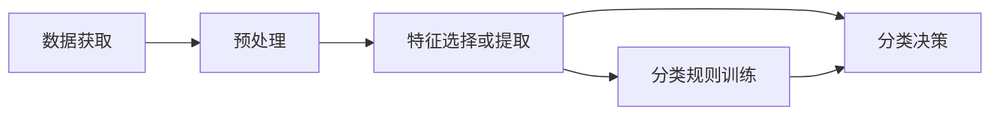

# 第一章 绪论

## 一、模式和模式识别的概念

### 1、名词解释

#### 模式识别

确定一个样本类别属性（模式类）的过程，即把某一样本归属于多个类型中的某个类型

#### 样本

一个具体的研究的对象，例：患者、汉字、图片

#### 模式

对客体的特征的描述，是取自客观世界的某一样本的测量值的集合

**样本包含模式，模式识别识别模式**

#### 特征

能描述模式特征的测量值。在模式识别方法中，通常用矢量$\vec{x}$ 表示，称之为特征矢量，记为$\vec{x}=(x_1,x_2,...,x_n)'$

#### 模式类

具有某些共同特性的模式的集合

## 二、模式识别系统模型

### 1、模式识别系统框架

数据获取->预处理->特征选择或提取->分类规则训练->分类决策

**notice**

- 模式识别系统处理的是任意数据
- 模式识别系统输出的是数据的分类结果
- 模式识别系统处理的是数据中的特征

### 2、数据获取模块

**功能**

用数字符号来表示所研究的对象

**数据获取方式**

- 摄像机：视频图像
- 录影机：语音信号
- 传感器：测量温度等各种数据

### 3、预处理模块

**功能**

- 去噪声。去掉不相关的信息，提取有用的信息
- 突出主要成分
- 区域划分
- 数据完善。对输入测量仪器或其他因素所造成的退化现象进行复原

**预处理例子：**

- 图像缩放
- 数据标准化
- 数据归一化
- 区域划分

### 4、特征提取和选择

**功能**

- 对原始数据进行变换，得到最能反应分类本质的特征

**特征选取：**

- 剔除无意义的特征
- 通过变换获得更有意义的特征

**相关概念**

- 测量空间：原始数据组成的空间
- 特征空间：分类识别赖以进行的空间
- 模式表示：维数较高的测量空间->维数较低的测量空间

### 5、分类决策

**功能**

- 在特征空间中用模式识别方法把识别对象归为某一类类别

**基本做法**

- 确定判决规则
- 按规则分类，错误率最小或损失最小

**例子**

- 从人脸图片中挑出张三人脸
- 声音分类
- 性别分类

### 6、分类规则训练

**功能**

通过对样本的学习，调节分类规则中的参数

**基本做法**

- 输入样本

- 使用现有参数对样本进行识别，计算识别误差，根据误差调节参数

**相关概念**

- 训练又称为学习
- 学习：有监督学习、无监督学习、强化学习

- 有监督学习：样本+标签
- 无监督学习：有样本，无标签
- 强化学习：赏罚分明、训练网络+判决网络

## 三、模式识别的分类

### 1、按理论分类

**分类方法**

- 统计模式识别
- 句法模式识别
- 模糊模式识别
- 神经网络模式识别

**统计模式识别**

采用概率论与数理统计的方法。采用判别函数，使得误判概率最小。

**句法模式识别**

对模式的结构进行分析；先将模式表示为基元，再分析基元构成的句法结构

**模糊模式识别**

以隶属度u为基础，采用模糊数学知识

**神经网络模式识别**

以人工神经元为基础，模拟人脑神经细胞的工作特点。对脑部生理机制进行模拟，实现形象思维的模拟

### 2、按实现分类

**监督分类**

采用判别函数进行分类判别。需要有足够的先验知识

**非监督分类**

用于没有先验知识的情况下，通常采用聚类分析的方法

## 四、模式识别的应用

### 1、宏观领域的应用

### 2、生物识别应用

**生物识别的定义**

根据每个人独有的可以采样和测量的生物学特征（生理特征）和行为学特征进行身份识别的技术

**例子**

- 指纹识别：最早、最成熟的识别技术。
- 掌纹识别：研究纹线上某几个点的幅值（灰度值）、线长与线所对应的角之比等特征。
- 人脸识别
- 虹膜识别 
- 签名识别
- 击键分析 

## 五、模式识别数学基础

### 1、几何分类

#### 特征矢量

设一个研究对象的n个特征量的测量值，分别为$x_1,x_2...x_n$ ，将它们作为一个整理来考虑，构成一个n维特征矢量$\vec{x}$ 

#### 特征空间

各种不同取值的特征矢量的全体构成n维特征空间。

#### 两者的关系

特征矢量是特征空间的一个点

### 2、概率分类

#### 随机变量

如果特征分量的每次观测值都不确定，则该特征分量为随机变量。

#### 随机矢量

若特征矢量的每个特征分量都是随机变量，称其为随机矢量

#### 分布函数

设$\vec{X}=(X_1,X_2,...X_n)'为随机矢量，\vec{x}=(x_1,x_2,..,x_n)'为确定性矢量。$

随机矢量的联合概率把分布函数定义为：
$$
F(x_1,x_2,..,x_n)=P(X_1<x_1,X_2<x_2,...X_n<x_n)\\
F(\vec{x})=P(\vec{X}<\vec{x})\\
式中p(.)表示括号中事件同时发生的概率
$$

#### 概率密度函数

$$
随机矢量\vec{X}的联合概率密度函数定义为：\\
p(x_1,x_2,...x_n)\triangleq p(\vec{x})=\frac{\delta^nF(x_1,x_2,..,x_n)}{\delta x_1\delta x_2...\delta x_n}\\
解释:概率密度函数就是分布函数的导数，相当于单位区域内的概率
$$

#### 随机矢量的描述-数字特征

**均值矢量（期望矢量）***

**协方差矩阵**

**自相关矩阵**

**相关系数**

**不相关**

**正交**

**独立**

#### 正态分布

### 3、矩阵运算

#### 内积

#### 外积

#### 微商

#### 矩阵的迹

#### 矩阵的运算

#### 矩阵的逆

#### 特征值与特征向量

