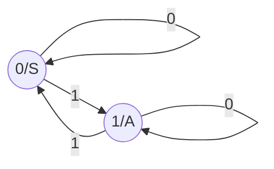
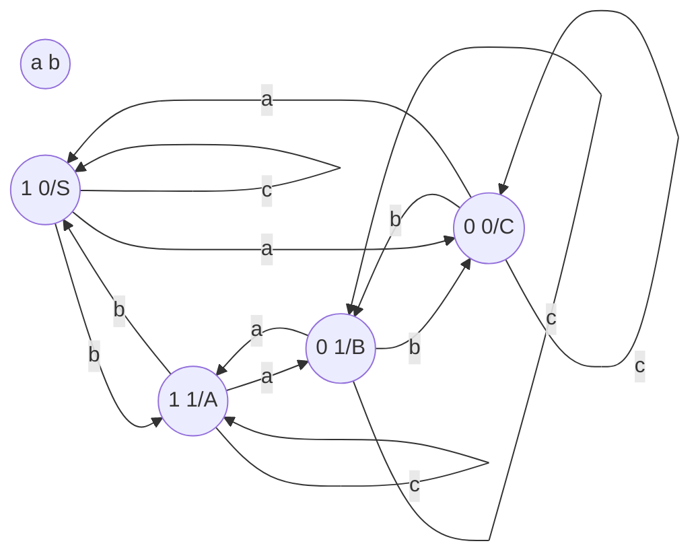

# Language & Syntax Description

## Alphabet & String

### **Alphabet**（字符表）

非空符号集，通常用$\sum$ 、V或者其他大写希腊字母表示

### **Symbol（Character)**

字符表中的元素，语言中的基本元素

### **String**

字符表中的符号的有限序列

- 空字符串是没有任何符号的字符串，记为$\varepsilon$ 

### **Sentence**

基于某些构造规则中字母表中的符号的一组字符串集合

### **Language**

字符表中的句子集合

### **Notice**

按照惯例，符号表示为a、b、c……；字符串表示为α、β、γ……；一组字符串表示为a、b、c……

### **Operations on the sets of strings（sentence)**

- Concatenate (Product) Operation(串联/积运算)

  -  A={$\alpha$~1~,$\alpha$ ~2~,…},B={$\beta$~1~,$\beta$~2~,...} AB={$\alpha\beta$|$\alpha\subset$A and $\beta\subset$B}

- 幂运算

  - A^0^={$\epsilon$}
  - 字母表a的n次方是所有长度为n的字符串的集合A^n^=all strings（length is n)

- 闭合与正闭合

  - 闭包

    $A^*= A^1\cup{A^2}\cup{...}$

    它是指字母表A上所有字符串的集合（包括空字符串）

  - 正闭包

    $A^+$=$A^1 \cup A^2 \cup ...=A^* - \epsilon$

    语言是字母表上正闭包的子集

    

## Grammar & Language 

### Basic concepts

#### **Grammar**

定义字符串之间关系的一组规则

G=(V~N~,S,V~T~,P)

一个文法是描述一个核心概念

core concept（核心概念）->supporting concept(V~N~)（支撑概念）->atomic concept(V~T~)（原子概念）

语法是形式化的产生式规则，它描述语法元素的构建

#### **语法元素**

- 句子（sentence）
- 单词序列（word in sentences)
- 语言(language)是由句子（sentence）构成的

#### **规则（rules)**

- condition->action(if condition then action)
- cause->result
- left side->right side

#### **非终结符(Non-terminal symbol)**

- 位于left side,用<>括起来表示（采用大写字母）
- 一组非终结符用V~N~表示，（采用小写字母）

#### **非终结符号的表示**

- 在字母表中排在前面的大写字母如A、B、C
- 字母S，他出现时通常表示开始符号
- 小写、斜体的名字，比如expr、stmt

#### **终结符(Terminal symbol)**

无法分解的语言中的字符串（包括单个字符的字符串），记为V~T~

#### **终结符表示**

- 在字母表中排在前面的小写字母，如a，b，c.
- 运算符号，比如+、*等
- 标点符号，比如括号、逗号等
- 数字0、1、2、3、4、5、6、7、8、9
- 黑体字符串，比如id或这if。每个这样的字符串表示一个终结符号

#### **开始符（Start symbol)**

- 一种特殊的非终结符号，是定义语法的核心
- 开始符也被命名为标识符号

#### **production**（组成）

- form:$A \rightarrow \alpha\ (A \  produce\   \alpha )\  \alpha\in(V_T\cup V_N)^*$
- $<Sentence> \rightarrow <Subject><Predicate>$

#### **Derivation**(推导)

- 从"开始"符号开始并派生句子的过程，通过在生产规则中用右侧替换左侧派生句子

- 最左推导：总是对当前句型的最左边非终结符进行推导

- 最右推导：总是对当前句型的最右边非终结符进行推导

- 混合推导：左右推导的结合

- 最左、最右推导合成正则推导

- Top-down

- E.G：

  $S\rightarrow\ ABC$：产生

  $S\Rightarrow ABC$：推导

**problem**

- backtracking:回溯
  - $A\rightarrow \alpha|\beta$
  - try efficiency

**solve**

- 预测分析法

#### **Reduction**（归约）

- 归约是推导的反向过程，即从句子实例本身开始，找出可归约串进行归约

- 可归约串：出现在右部的整体

- 最左归约：总是对最左可归约串进行归约，最右推导的逆过程

- 最右归约：总是对最右可归约串进行归约

- E.G

  $ABC\equiv>S$ 

#### **Sentential form**(句型)

- 最抽象的句型是一个句子的开始符
- 由开始符推出的终结符或者非终结符序列
- 写做$S\Rightarrow^*\alpha ,\alpha\ \in (V_n\cup V_T)^*$ 

#### **Sentence**(句子)

一个只包含终结符的句子实例

#### **Language**

- 从S推导出的一个或多个的字符串集合记作：$L(G)=\{\alpha|S\Rightarrow^+ \alpha ,and\  \alpha \in V_T^*\}$
- 描述方法：枚举法、解析表示法（Analiystic)

**语法规则扩展符号**

- ( )提取因子

  E.g：

  $U\rightarrow ax|ay|az\  Rewritten\ as\ U\rightarrow a(x|y|z)$

- { }重复数的赋值

  E.g：$<Identifier>\rightarrow<Letter>\{<Letter>|<Digit>\}^5\ _0$

- [ ]可选符号

  E.g:$<Interger>\rightarrow[+|-]<Digit>\{<Digit>\}$

#### **元语言符号**

用来描述语法符号关系的符号，比如$\rightarrow和|$被称为元语言符号

### Formal Definition

#### **Grammar definition**(文法)

- 一个文法G被定义为四元组$(V_n,V_T,P,S)$ 
- P:产生式

#### Catalog of grammars（文法目录）

文法目录:根据产生式规则在语法中的局限性，我们可以将文法分为4类：0型文法、1型文法、2型文法和3型文法

**0型文法**

对于产生式$\alpha \rightarrow \beta,\alpha\in V^+and\  \beta \in V^*$

$\alpha$中至少含有一个非终结符

**1型文法(长度增加文法）**

对于产生式$\alpha \rightarrow \beta$，使右部文法长度大于左部文法长度，$|\beta|>|\alpha|$

- 除了$S\rightarrow\varepsilon$

Context-Sensitive grammer：上下文有关文法

**2型文法（上下文无关文法）**

无论上下文如何，始终有产生式$A\rightarrow\beta,A\in V_N,\beta\in V^*$

- 产生式左边是非终结符
- 产生式右边可以是$V_N,V_T,or \ \varepsilon$

**3型文法(正规文法）**

类似于$A\rightarrow \alpha B\  or \  A\rightarrow\alpha\ \\ A,B\in V_N,\alpha\in V_T^*$

A产生终结符和非终结符的组合或者只有终结符

$A\rightarrow B\  等价于A\rightarrow \epsilon B$，也属于3型文法

**关系**

2型文法—3型文法=嵌入式文法（$A\rightarrow \alpha B\beta$）

#### i-type language

$L(G): L(G)=\{w|w\in V_T^* ，and\   S\rightarrow ^+w\}$

### Grammar Simplification 

#### Useless production（无用产生式）

- $P\rightarrow P$
- $A\rightarrow B,B\rightarrow C,C\rightarrow A$
- 无用非终结符对应的产生式
  - 对任意$A\in V_N$，A  is not  related to S
- 推不出终结符序列的产生式
  - 对任意$A\in V_N,A\nRightarrow^+ \alpha,\alpha \in V_T^*$

## $Language\Rightarrow Grammar$

### method1

对称法，使用嵌入式文法

- 找到对称组$S\rightarrow aab$
- 找到对称中心$S\rightarrow aaSb$

**回文数**

- 对称组
  - $S\rightarrow 0|1|2|3|4|5|6|7|8|9|$
  - $S\rightarrow |1A1|2A2|...|9A9|$
  - $A\rightarrow |\varepsilon|0|1|2|3|4|5|6|7|8|9|$
- 对称中心
  - $A\rightarrow |0A0|1A1|...|9A9|$

### method2

逐步分解法

**Top Down**

- $a^i=A,b^j=B,c^k=C$
- $S\rightarrow ABC$
- $A\rightarrow aA|a$
- $B\rightarrow bB|b$
- $C\rightarrow cC|c$

各成分之间无关联

**Left Right**

- $b^jc^k=A$

- $S\rightarrow aS|aA$
- $A\rightarrow bA|bB$
- $B\rightarrow cB|c$

**改：**

$a^ib^j(i\ge j\ge 1)$

$a^ib^j=a^{i-j}a^jb^j=a^ma^jb^j(m\ge0,j\ge 1)$

$S\rightarrow AB \\A\rightarrow aA|\varepsilon \\B\rightarrow aBb|ab$

### method3

等价法

$S:|A|=|B|,A:|a|+1=|b|,B:|a|=|b|+1$

$S\rightarrow aA|bB|\varepsilon$

$A\rightarrow aAA|bS|b$

$B\rightarrow aS|bBB|a$

**改**

$S:|a|\ne |b|$

$A:|a|>|b|,B:|a|<|b|$

$A_1：|a|=|b|+1,B_1:|a|+1=|b|$

$C：|a|=|b|$

**解一：**

$S\rightarrow A|B$

$A\rightarrow A_1A|A_1$

$B\rightarrow B_1B|B_1$

$A_1\rightarrow aC|bA_1A_1$

$B_1\rightarrow aB_1B_1|bC$

$C\rightarrow aB_1|bA_1|\varepsilon$

**解二**

$C:|a|=|b|\\S\rightarrow SCS|SC|CS|a|b\\C\rightarrow aCbC|bCaC|\varepsilon$

### method4

电路状态转换法，奇偶问题。

**流程**

- 确定电路转换图的状态
- 确定状态之间的连接与编译
  - 每个状态发出边中n条边到其他状态
  - 每个状态发出边中m条边到自身
- 确定开始和结束状态
  - 1、假设全是0的状态为$end\ state$，$requirement\rightarrow start\ state$
  - 2、全是0的状态为$start\ state,requirement\rightarrow end\ state$
- 任意挑选状态为$end\ state\ or\ start\ state$
- 写出相关的产生式
- 加上终态的$\varepsilon$产生式

**特征**

- 对于文法中有n个符号关心奇偶，m个符号不关心奇偶

- 1代表相关字符个数为奇数，0代表相关字符为偶数
- 状态个数：$2^n$
- 产生式的个数：$2^n*(n+m)+1$

**例1**

$L(G)=\{\omega|\omega\in(0,1)^* and\ the\ number\ of\ 1\ appeared\ in\ \omega\ is\ even\}$

$S\rightarrow 0S|1A|\varepsilon\\A\rightarrow 1S|0A$

**例2**

$L(G)=\{\omega|\omega\in(a,b,c)^*,a:odd,b:even\}$

$S\rightarrow aC|bA|cS\\A\rightarrow aB|bS|cA\\B\rightarrow aA|bC|cB\\C\rightarrow aS|bB|cC|\varepsilon$

### method5

混合方法

**例1**

$(G)=\{\omega|\omega\in(a,b,c,d)^*,\omega\ start\ with\ a\ or\ b,\ end\ with\ c,\ a:odd,b:odd,d:odd\}$

$S\rightarrow aA|bG\\E\rightarrow aC|bD|cE|dF|cZ$

$Z\rightarrow \varepsilon\\...$

**例2**

$L(G)=\{\omega|\omega\in(a,b,c,d)^*,start\ with\ a,end\ with\ b\ or\ c\ ,a、b、d：odd\}$

### method6

FA-based方法

- 构造FA
- 确定终态和初态
- 命名
- 写出相关产生式
- 终态$\varepsilon$产生式

$L(G)=\{\omega|\omega\in(0,1)^*,\omega_{10}\ mod\ 5=0,\varepsilon_{10}=0 \}$

**左线性正规文法**
$$
S\rightarrow S0|\varepsilon\\
A\rightarrow S1\\B\rightarrow A0\\
C\rightarrow A1\\
...
$$

## 语法构造与简化

### 语法优化

**Good Grammar**

- method1:删除无用产生式
- method2:删除$\varepsilon$产生式

### 删除$\varepsilon$产生式

#### $\varepsilon$ -production

$V_0=\{A|A\Rightarrow^+\varepsilon\ ,A\in V_N^*\}$

#### 迭代

$$
A=B\cup\{a\}\\
B=A\cup\{b\}\\
初始：A=\phi,B=\phi\\
第一步：A=\{a\},B=\{b\}\\
第二步：A=\{a,b\},B=\{a,b\}\\
第三步：A=\{a,b\},B=\{a,b\}\\
最终：A=\{a,b\},B=\{a,b\}
$$

#### 一、构造$\varepsilon$ -production

- 将所有可以一跳推出$\varepsilon$终结符的非终结符归为$V^{'}_0$ 
-  将右部包含$V^{'}_0$中的非终结符换成$\varepsilon$后可以推出空的产生式归为$V^{''}_0$
- 以此类推

**例**

$S\rightarrow ABC\\A\rightarrow aA|\varepsilon\\B\rightarrow bB|\varepsilon\\C\rightarrow cC|\varepsilon$
$$
V^{'}_0=\{A,B,C\}\\
V^{''}_0=V^{'}_0 \cup \{S\}\\
V^{'''}_0=V^{''}_0\cup \phi=V^{''}_0=V_0
$$

#### 二、改写相关产生式

$$
\begin{align}
&改写产生式:S\rightarrow ABC\\
&对于每一个A\in V_0,A\rightarrow self(1),A\rightarrow\varepsilon(0)\\
&S\rightarrow ABC(111)\\
&S\rightarrow BC(011)\\
&S\rightarrow AC(101)\\
&S\rightarrow BC(011)\\
&S\rightarrow A(100)\\
&S\rightarrow B(010)\\
&S\rightarrow C(001)\\
&S\rightarrow \varepsilon (000)
\end{align}
$$

如果一个非终结符在产生式右部出现多次，则将他们看成不同的终结符

#### 三、删除所有$\varepsilon$产生式

除了$S\rightarrow \varepsilon$，将其他$\varepsilon$产生式都删除

#### 四、dealing with $\varepsilon$

$$
S\rightarrow \varepsilon\Rightarrow S^{'}\rightarrow S,S^{'}\rightarrow \varepsilon
$$

#### 五、检查无用产生式

在删除$\varepsilon$产生式后，还有检查是否生成无用产生式，并将其删除

## 文法二义性

### 二义句子

如果一个句子有两个或者多个分析树，则该句子被称为二义句子（Ambiguity of sentence）

$$
\begin{align}
&Example：G=(\{E\}，\{+,*,(,),i\}，P，E)\\
&where：E \rightarrow E+E | E*E | (E) | i
\end{align}
$$
**syntax Tree1**

**syntax Tree2**

**解决办法**
$$
\begin{align}
&E\rightarrow E+F|F\\
&F\rightarrow F*G|G\\
&G\rightarrow i
\end{align}
$$

离开始符越近，优先级越低。