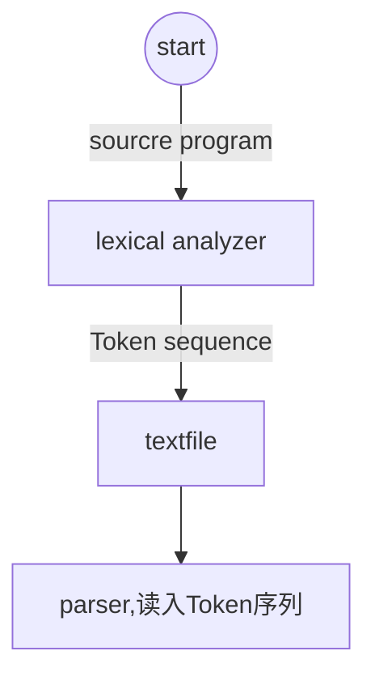
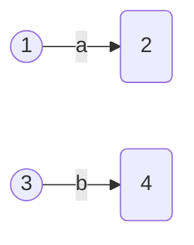
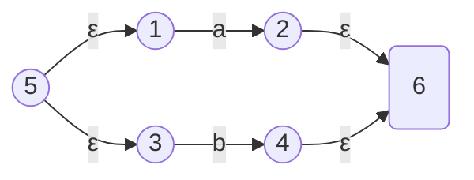
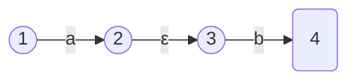
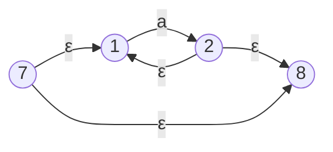
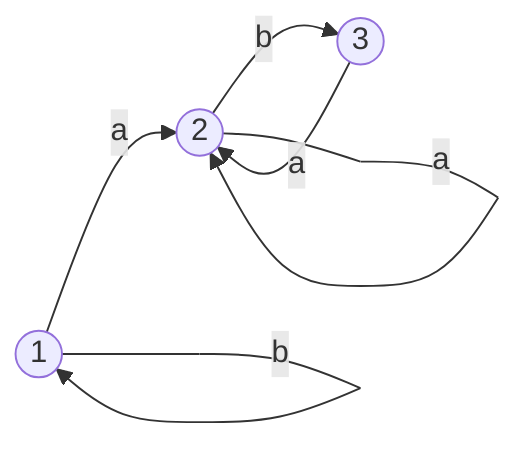
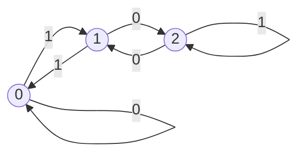

# LEXICAL ANALYSIS


## 一、lexical analyzer


### 1.1 词法分析器与解析器的交互


#### 松耦合方法



#### 紧耦合方法


#### Token

- 源程序中的单词类型
- 关键字、运算符、标识符、常量、文本字符串、标点符号（如逗号、分号）

**组成**

- lexeme：源程序中的词素
- Catalog：实际词素的类型
- InnerCode：内部码


**ID table**

|  Name  | catalog |  ID  | ...  |
| :----: | :-----: | :--: | :--: |
| abc(1) |         |      |      |
|  ...   |         |      |      |
| bbb(5) |         |      |      |


$$
token("abc")=("abc",ID,1)\\
token("bbb")=("bbb",ID,5)
$$


## 二、Token序列的规约


### 2.1 在正则表达式中定义

e.g:
$$
\begin{align}
&Id\rightarrow letter(letter|digit)\\
&letter\rightarrow A|B|...|Z|a|b|...|z\\
&digit\rightarrow 0|1|2|...|9\\
&or\\
&id\rightarrow a(a|1)^*
\end{align}
$$
正则表达式是指定模式的重要符号。每个模式都匹配一组字符串，因此正则表达式将用作字符串集的名称。


### 2.2 正则表达式与正规语言


**正则表达式**

- 允许我们用高级语言定义模式的符号。


**正规语言**

- 每个正则表达式$r$表示一种语言$L(r)$（与正则表达式r相关的一组句子）
- 程序中的每个词素都可以用正则表达式表示


### 2.3 字母表$\sum$的正则表达式的规则

- $\varepsilon 是表示\{\varepsilon\}$的正则表达式
- 如果a是字母表$\sum中的一个符号，那么a是表示\{a\}$ 的正则表达式
- 如果$\alpha、\beta$是正则表达式，那么$\alpha|\beta、\alpha\beta、\alpha^*、\beta^*$也是正则表达式


### 2.4 正则表达式的代数定律

$$
\begin{align}
&1、\alpha|\beta=\beta|\alpha\\
&2、\alpha|(\beta|\gamma)=(\alpha|\beta)|\gamma\ \ \alpha(\beta\gamma)=(\alpha\beta)\gamma \\
&3、\alpha|(\beta|\gamma)=\alpha\beta|\alpha\gamma\\
&4、\varepsilon\alpha=\alpha\varepsilon=\alpha\\
&5、(\alpha^*)^*=\alpha^*\\
&6、\alpha^*=\alpha^+|\varepsilon\ \ \alpha^+=\alpha\alpha^*=\alpha^*\alpha\\
&7、(\alpha|\beta)^*=(\alpha^*|\beta^*)^*=(\alpha^*\beta^*)^*\\
&8、if\ \varepsilon\notin L(\gamma),then\\
&\ \ \ \ \ \ \alpha=\beta|\gamma\alpha\Leftrightarrow \alpha=\gamma^*\beta\\
&\ \ \ \ \ \ \alpha=\beta|\alpha\gamma\Leftrightarrow\alpha=\beta\gamma^*
\end{align}
$$

我们假设*的优先级是最高的，而|的优先级是最低的，并且它们是左关联的


### 2.5 正则表达式的扩展


**一个或多个实例**

- $(r)^+$
- $digit^+$


**零个或者一个实例**

- $r?\Leftrightarrow r|\varepsilon$
- $(E(+|-)?digits)?$


**字符类**

- $[a-z]代表a|b|c|...|z$
- $[A-Za-z][A-Za-z0-9]$


## 三、Tokens识别


### 3.1 lexical analyzer的Token识别

| Regular expression | Token     | Attribute-value        |
| ------------------ | --------- | ---------------------- |
| if                 | **if**    | -                      |
| **id**             | **id**    | Pointer to table entry |
| <                  | **relop** | LT                     |


### 3.2 识别Token的方法


#### Transition Diagram


**note:**我们用*号表示哪一步需要进行输入收回

```c++
state=0
while(1)
{
    ch=getchar();
    switch(state):
    case 0:
    	if(ch==">")	
          state=6;
        else
          error;
    	break;
   	case 6:	
    	if(ch=="=")
       	 	state=7
    	 else
         	state=8
         break;
    case 7:
    	return(Token('>=',relop,GE));//返回Token序列
    	break;
    case 8；
        ungetchar();//输入收回
    	return (Token('>',relop,GT))
}
```


### 3.3 广义转移图


#### 有限自动化(FA)

- FInite Automation

- 确定性或者非确定性FA
- 非确定性意味着在同一输入符号上可能有一个以上的状态转换


### 3.4 Tokens识别模型


## 四、有限自动机


### 4.1 FA

Finite automata,有限自动机

#### FA的作用

- 精确识别正则集
- 正则集是与正则表达式相关的一组句子

#### FA的种类

- Deterministic FA：确定性FA
- Non-deterministic FA：不确定性FA


### 4.2 word construction rule

- RG
- regular Expression：word template

$FA\to program\to NFA\to DFA$


### 4.3 Deterministic FA (DFA)

#### 定义

DFA是一个五元组，$M(S,\sum\cup\{\varepsilon\},move,s_0,F)$

- S：状态集
- $s_0$：开始状态，$s_0\in S$，只有一个
- $F$：结束状态集，$F\subseteq S$，可以多个
- $\sum$ ：输入的字符表，边上的标记
- $move$：转换函数，$SX\sum\to S, move(s,a)=s^{'}$

#### 特点

- 边上的标记不能是$\varepsilon$ ，只要存在$\varepsilon$边，则为NFA
- 后继状态必须唯一确定
- $move$映射只能为多对一或一对一的映射，即函数映射（functional mapping）

#### e.g

​	Construct a DFA  M，which can accept the strings which begin with a or b, or begin with c and contain at most one a


$$
(a|b)(a|b|c)^*\ |\ c(b|c)^*\ |\ c(b|c)^*a(b|c)^*
$$


### 4.4 Non-deterministic FA(NFA)

#### 定义

NFA是一个五元组，$M(S,\sum\cup\{\varepsilon\},move,s_0,F)$

- S：状态集
- $s_0$：开始状态，$s_0\in S$，只有一个
- $F$：结束状态集，$F\subseteq S$，可以多个
- $\sum$ ：输入的字符表，边上的标记
- $move$：转换函数，$SX\sum\to 2^S,move(s,a)=2^S,2^S\subseteq S$

#### 特点

- 允许出现$\varepsilon$边
- 可以出现多个后继状态
- 映射可以为一对多或者多对多，$SX\sum\to2^{S}$，powerset of S，$move(i,a)=\{j,k\}$
- DFA是一种特殊的NFA

**power of set**

- 幂集，一个集合的全部子集构成的集合，记为$2^S$
- $|S|=n,|2^S|=2^n$


### 4.5 NFA $\Rightarrow$ DFA

- 根据N的情形
  - 含有$\varepsilon$边：$\varepsilon$闭包
  - 有多个后继状态：子集构造法


####  $\varepsilon$ -closure(T) 

$\varepsilon$闭包，T为一个核，从T开始按照广度优先算法，将由$\varepsilon$边推出的状态加入到新的集合里，构成T的$\varepsilon$闭包


#### Subset Construction algorithm 

**步骤**

- $I_0=\varepsilon-closure(S_0),I_0\in Dstates$
- 对于每一个$I_i,I_i\in Dstates$，
  - 让$I_t=\varepsilon-closure(move(I_i,a))$
  - 如果$I_t\notin Dstates$，那么把$I_t$放入$Dstates$中
- 重复第二步，直到没有新的状态可以放入$Dstates$中
- $F=\{I|I\in Q,且I\cap Z<>\phi\}$
- 终态确定：$如果I_i\cap F\neq\phi,I_i是一个终态$


#### **特点**

- 核相同，闭包一定相同
- $|S_{NFA}|=n,\max_{|S_{DFA}|}=2^n-1$


### **4.6 优化DFA**

减少DFA的状态数


#### 思想

- 对状态进行分组或者分类(Grouping / classifying)：**等价类划分**


#### 等价类划分（ECD)

- 自下而上组合（Bottom-Up Combination）
  - 又称Clustering聚类方法
  - Centroid:质心
  - 确定种子状态，根据质心到点的距离大小拉取其他执行点


- **自上而下逐步分解（Top-Down Step Divison)**
  - 先分成终态和非终态
  - 对每一个叶子节点采用弱等价进行分解
  - 再分类结束后的每个状态子集选取一个状态作为代表点
  - **回头看**：后续状态的分解可能会影响前面已经分好类的状态集
  - 生成状态转换图


#### 两个状态等价

- 两状态发出边数相同
- 两状态边上对应的标记对应相同
- 两个状态相同边推出的后继状态也要**等价**（强等价或弱等价）
- **强等价：**分解树当前的叶子节点推出的后继状态完全相同
- **弱等价：**分解树当前的叶子节点推出的后继状态属于同一个状态子集


#### Example1

减少该DFA的状态数


$$
\begin{align}
&初始：\prod=\{\{0,1,2\},\{3,4,5,6\}\}\\
&第二步：\\
&a:move(\{0,1,2\},a)=\{1,3,1\} \rightarrow \prod=\{\{0,2\},\{1\},\{3,4,5,6\}\}\\
&b:move(\{0,1,2\},b\})=\{2,2,5\}\rightarrow \prod=\{\{0\}，\{2\}，\{1\}，\{3，4，5，6\}\}\\
&第三步：\\
&a:move\{\{3,4,5,6\},a\}=\{3,6,6,3\}情况不变\\
&b:move\{\{3,4,5,6\},b\}=\{4,5,5,4\}情况不变\\
&第四步：\\
&最终：\prod=\{\{0\}，\{2\}，\{1\}，\{3，4，5，6\}\}，从各个叶子节点中各挑选一个状态：\\
&group:\{0,1,2,3\}\\
&第五步：
画状态转换图
\end{align}
$$


#### Example2


## 五、RE $\Rightarrow$ NFA

由正规文法到NFA

### 5.1 自上而下逐步求进

#### Rules

- For $\varepsilon$ ：


- For a in $\sum$：


- $\alpha\beta$：


- $\alpha|\beta$：


- $\beta^*$：


#### example1

$((a^*b)^*(a|b)^*)^*(a|b)^*(a|b)$


#### example2

$r=(a|b)^*(aa|bb)(a|b)^*$


### 5.2 自下而上组合方法

Bottom-Up Combination

#### Rules

- For a  or b:



- $a|b$：



- $a\cdot b$：



- $a^*$



#### example

$(a^*\cdot b)^*\cdot(a|b)$

- 将正规文法中的中辍变为后辍
- postfi$\Rightarrow$NFA


## 六、FA$\to$RE

A FA to Regular expression，从有限状态机到正则表达式

### Rules


### Example1

E.g. Construct the regular expression for the following DFA  M


**解：**


### Example2

不出现abb子串的字符串序列

**Answer**

构造状态转换图：



其中1为开始状态，1、2、3状态均可以为终态：

**1为终态：**$b^*$

**2为终态：**$b^*a(ba|a)*$

**3为终态：**$b^*aa^*b$
$$
b^*|b^*a(ba|a)^*|b^*aa^*b
$$


### Example3

$L=\{i|i\ mod\ 5=0,i\in N\cup\{0\}\}$

**Answer:**
$$
r\to 0|5|(1|2|3|4|5|6|7|8|9)(0|1|2|3|4|5|6|7|8|9)^*(0|5)
$$


### Example4

$L=\{w|w\in(0,1)^*,w_{10}\ mod\ 3=0,\varepsilon_{10}=0\}$

**Answer：**

$末尾加0：X2\\末尾加1：X2+1$

构造状态转换图



其中0为开始态，也为终态：
$$
(0|1(01^*0)^*1)^*
$$


## 七、RG $\Leftrightarrow$NFA


### 7.1 RG $\to$FA


#### method

- 输入：$G=(V_N,V_T,P,S)$

- 输出：FA $M=(Q,\sum,move,q_0,Z)$

- method：
  - 将正规文法中的所有非终结符作为状态集，并加入一个状态T
  - 使得$Q=V_N\cup\{T\}，\sum=V_T，q_0=S;$如果存在产生式$S\to\varepsilon$，那么$Z=\{S,T\}$，否则$Z=\{T\}$
  - 对于每一个产生式：
    - $A_1\to aA_2$，构造$move(A_1,a)=A_2$
    - $A_1 \to a$，构造$move(A_1,a)=T$
    - 对于在字符集$\sum$ 中的单个字符$a$，构造$move(T,a)=\Phi$

  

  #### Example

  E.g. A regular grammar $G=(\{S,A,B\},\{a,b,c\},P,S) $

  P:     $S \to aS |aB$                   
            $ B\to bB|bA$ 
             $A \to cA|c$
      Construct a FA for the grammar G.


### 7.2 FA $\to$RG


#### method

- 输入：$M=(S ,\sum,f, s_0,Z) $
- 输出：$Rg=(V_N,V_T,P,s_0)$
- method:
  - $if\  s_0\notin Z:$
    - 对于映射$f(A_i,a)=A_j$，有产生式$A_i\to aA_j$
    - 如果 $A_j\in Z$，产生式为$A_i\to a|aA_j$
  - $if\ s_o\in Z:$
    - 除了基于前一个规则得到的结果外，我们还将得到以下结果：
    - 对于映射$f(s_0,\varepsilon)=s_0$,构造新的产生式$s^{'}_0\to \varepsilon|s_0$，$s^{’}_0$是一个新的状态

#### Example


## 八、 词法分析器的设计


