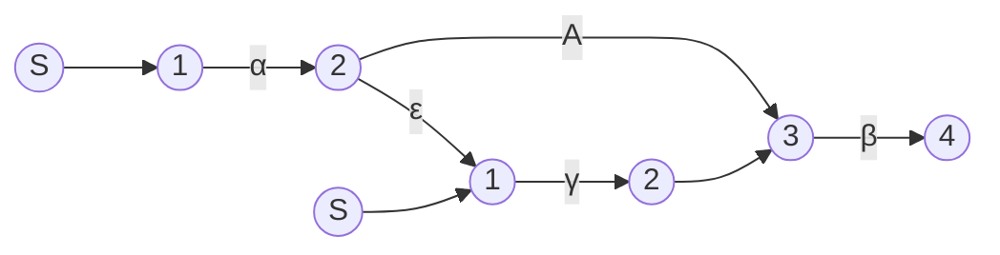
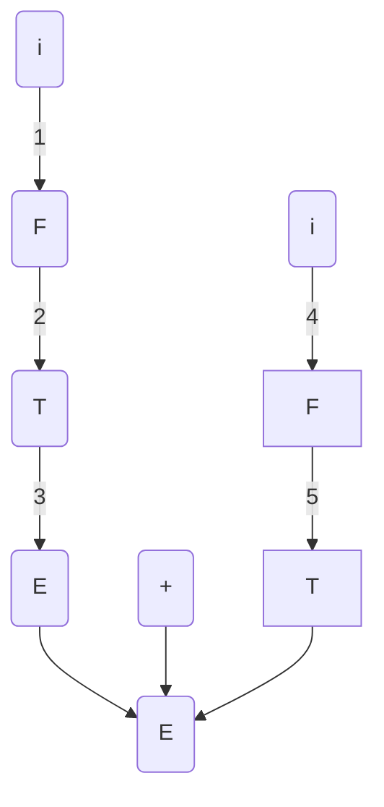

# Syntax ANALYSIS（语法分析）


## 一、实现语法分析器的方法


### 1.1 语法描述

程序设计语言结构的语法描述：

- 上下文无关文法
- BNF(Backus Naur Form) 表示法

语法为语言设计者和编译器编写者提供了显著的优势


## 二、Parser（解析器）


### 2.1 主要工作

- 从词法分析器中获取Token序列

- 验证字符串是否可以由相关编程语言的语法生成

- 以可理解的方式报告任何语法错误

- 从常见错误中恢复，以便它可以继续处理其输入的其余部分


### 2.2 解析器的位置


### 2.3 解析方法

**Universal parsing method**

通用解析方法，在生产编译器中使用效率太低


**Top-Down**

自上而下的方法，从顶部（根）到底部（叶子节点）构建解析树


**LL(1)文法**

通常手工实现


**BOTTOM-UP method**

自下而上的方法，从叶子节点开始，一直到根部


**LR文法**

从左到右扫描输入，通常由移动化工具构建


### 2.4 语法错误处理


#### Error Levels

- 词法，例如拼写标识符、关键字或运算符

- 语法的，如带不平衡圆括号的算术表达式

- 语义的，如应用于不兼容操作数的运算符

- 逻辑的，如无限递归调用


#### 错误处理的目标

- 简单地说明错误处理程序的目标

- 它应该清楚准确地报告错误的存在

- 它应该能够足够快地从每个错误中恢复，以便能够检测到后续的错误

- 它不应该显著地减慢正确程序的处理速度


## 三、TOP-DOWN 解析


### 3.1 主要思想

- 查找输入字符串最左边的派生

- 为输入构造一个解析树，从根开始并创建解析树的节点


### 3.2 主要方法

- **Predictive parsing：**预测性分析（无回溯）
- **Recursive descent：**递归下降（包括回溯）
- 注意：回溯对于解析编程语言结构来说是很少需要的，因为回溯仍然不是很有效，并且表格方法是首选的


### 3.3 递归下降法


#### 主要思路

- 每一个终结符对应一个子程序
- 每个非终结符对应一个判定

#### Example

$$
\begin{align}
&S\to ABC\\
&A\to aA|b\\
&B\to cB|d\\
&C\to eC|f

\end{align}
$$

**main：**

```c++
a=S();
```

**S()：**

```c++
int S(){
if A()
    if B()
        return C();
    else
        return 0;
else
    return 0 
}
```

**A():**

```c++
int A(){
    ch=getchar();
    if(ch=='a')
        return A();
    else if(ch==‘b')
            return 1;
    else
            return 0;
}
```

#### 问题一：回溯

会造成回溯。例如
$$
\begin{align}
&S\to ABC\\
&A\to aA|aB\\
&B\to cB|d\\
&C\to eC|f

\end{align}
$$
**A（）：**

```c++
int A(){
    ch=getchar();
    if(ch=='a')
        if (A())
            return 1;
    	else
            return B();
    
}
    
```

#### 问题二：无限环

对于左递归的情况：
$$
\begin{align}
&S\to ABC\\
&A\to Aa|b

\end{align}
$$
**A():**

```c++
int A(){
ch=getchar();
if(ch=='b')
    return 1;
else if (A())
{
   if(ch=='b')
    return 1;
    else if(A())
    {
        ....
    }
}
else
    return 0;
    
}
```


### 3.4 预测解析法

Predictive Parsing Method

#### ①预处理

- 提取最大的公共组因子

$$
A\to \alpha\beta|\alpha\gamma\Rightarrow A\to \alpha(\beta|\gamma)
$$


#### ②消除左递归


**直接左递归**

$A\to A\alpha|\beta$

- 消除方法：把左递归变成右递归

$$
\begin{align}
&A\to A\alpha|\beta:\\
&第一步，变成RE：\beta\alpha^*\\
&第二步，变成右递归：\\
&A\to \beta A^{'}\\
&A^{'}\to \alpha A^{'}|\varepsilon
\end{align}
$$


**间接左递归**
$$
S\to Qc|c\\
Q\to Rb|b\\
R\to Sa|a
$$

- 消除方法：按优先级排序：$R,Q,S$，其中$S$优先级最高，高优先级具有剥夺低优先级的权利或者低优先级不能推出高优先级

$$
\begin{align}
&for\ R:no\ action\\
&for\ Q:Q\to Rb|b \Rightarrow Q\to Sab|ab|b\\
&for\ S:S\to Qc|c \Rightarrow S\to Sabc|abc|bc|c\\
&直接左递归消除：\\
&S\to (abc|bc|c)S^{'}\\
&S^{'}\to abcS^{'}|\varepsilon
\end{align}
$$


**混合左递归**
$$
\begin{align}
&S\to Sa|Ab|b\\
&A\to Sd|d|AC
\end{align}
$$

- 消除方法：由内而外，从最内层的循环开始处理

$$
\begin{align}
第一步：&S\to Sa|Ab|b\\
\Rightarrow &S\to (Ab|b)S^{'}\\
&S^{'}\to aS^{'}|\varepsilon\\\\
第二步：&A\to Sd|d|Ac\\
\Rightarrow &A\to (Sd|d)A^{'}\\
&A^{'}\to cA^{'}|\varepsilon\\\\
第三步：&整理\\
&存在S\to A\to S环，利用优先级法消除：\\
&A\to (AbS^{'}|bS^{'})dA^{'}|dA^{'}\\
&A\to AbS^{'}dA^{'}|bS^{'}dA^{'}|dA^{'}\\\\
消除：&
A\to (bS^{'}dA^{'}|dA^{'})A^{''}\\
&A^{''}\to (bS^{'}dA^{'})A^{''}|\varepsilon
\end{align}
$$


#### ③预测分析

- 构造分析表：Predictive Parsing Table，<u>用来预测相关产生式的使用</u>

- use stack、matching while <u>deriving（最左推导，压栈时从右向左压）</u>

**Model**


**预测分析程序**

- $X$：堆栈顶部的符号


- $a$：当前输入符号


- 如果$X=a=\$$，解析器将停止并宣布解析完成


- 如果$X=a\ne\$$，解析器从堆栈中弹出X并将输入指针前进到下一个输入符号
- 如果$X$是非终端，程序将查询解析表$M$的条目$M[X，a]$，该条目将是语法的$X$生成项或错误条目

**Example**


分析表M：

|      | i          | +             | *            | (          | )         | $         |
| ---- | ---------- | ------------- | ------------ | ---------- | --------- | --------- |
| E    | $E\to TE'$ |           |           |$E\to TE'$|||
| E`   |            | $E'\to  +TE'$ |              |            | $E'\to ε$ | $E'\to ε$ |
| T    | $T\to FT'$ |           |           |$T\to FT'$|||
| T`   |            | $T'\to ε$    | $T'\to *FT'$ |            | $T'\to ε$ | $T'\to ε$ |
| F    | $F\to i$   |               |              | $F\to (E)$ |           |           |


#### ④FIRST&FOLLOW

**FIRST**

- 如果$\alpha$是任意字符串的语法符号，定义$FIRST(\alpha)$是由$\alpha$任意次推导得到的字符串的首部

  $\alpha\in V^*,First(\alpha)=\{a|\alpha \to a\dots\dots,a\in V_T\}$

- $\alpha$是终结符：

  $\alpha=a,\alpha=\varepsilon,则First(\alpha)=\{a\}，First(\varepsilon)=\{\varepsilon\}$

- $\alpha$构成$\varepsilon$产生式：

  $\alpha \to^{+} \varepsilon$，那么$\varepsilon$也在$FIRST(\alpha)$ 

- $\alpha$是非终结符:
  $$
  \alpha=\alpha_1\alpha_2\dots\alpha_n，\alpha_j\in(V_N\cup V_T),1\le j\le n\\\\
  FIRST(\alpha)=
  \begin{cases}
  First(\alpha_1),\varepsilon\notin First(\alpha_1)\\
  First(\alpha_1)\cup First(\alpha_2),\varepsilon\in First(\alpha_1),\varepsilon\notin First(\alpha_2)\\
  \cdots
  \end{cases}
  $$
  

**FOLLOW**

- 为了解决$\varepsilon$产生式的推导，即什么时候用$\varepsilon$产生式

- 对于非终端$A$，$FOLLOW\{A\}$是能立即以某种句子形式出现在A右边的终结符a

$$
\begin{align}
&Follow(A)=\{a|S\to \dots Aa\dots,a\in V_T\}\\\\
&if\ S\to \dots A,那么$\in FOLLOW(A)
\end{align}
$$

- $S$是开始符，\$是输入终止符

$$
\$\in FOLLOW(S)
$$

- 对于产生式$A\to \alpha B\beta$：

$$
(First(\beta)-\varepsilon)\in Follow(B)
$$

- 对于产生式$A\to\alpha B\ or \ A\to\alpha B\beta，\varepsilon\in First(\beta)$

$$
Follow(A)\to Follow(B)
$$


**Example**


$$
\begin{align}
First(E)&=First(T)=First(F)=\{(,i\}\\
First(E')&=\{\varepsilon,+\}\\
First(T')&=\{*,\varepsilon\}
\\\\
Follow(E)&=Follow(E')=\{),$\} \\
Follow(T)&=Follow(T')=\{+,),$\}\\
Follow(F)&=\{*,+,),$\}
\end{align}
$$


#### ⑤构造预测分析程序

- 输入：Grammar G
- 输出：分析表

**Method**

1. 对于每一个产生式$A\to \alpha$，做第二步和第三步处理
2. 对于每一个在$First(\alpha)$中的终结符$a$，添加$A\to\alpha$到表$M[A,a]$中
3. 如果$\varepsilon$在$First(\alpha)$中，添加$A\to \alpha$到表$M[A,b]$，其中$b$是$FOLLOW(A)$中的终结符；如果$\varepsilon$在$First(\alpha)$中并且\$在$FOLLOW(A)$中，添加$A\to\alpha$到$M[A,\$]$中
4. $M$中的每个未定义项默认为**error**


**Example**


构造表：

|      | i          | +            | *            | (          | )         | $         |
| ---- | ---------- | ------------ | ------------ | ---------- | --------- | --------- |
| E    | $E\to TE'$ |           |           |$E\to TE'$|||
| E`   |            | $E`\to +TE`$ |              |            | $E`\to ε$ | $E`\to ε$ |
| T    | $T\to FT'$ |           |           ||||
| T`   |            | $T`\to ε$    | $T`\to *FT`$ |            | $T`\to ε$ | $T`\to ε$ |
| F    | $F\to i$   |              |              | $F \to(E)$ |           |           |


###  3.5 LL(1)Grammars


#### 定义

- 一种语法，其解析表没有多重定义的条目，称为LL(1)文法
- 第一个**L**表示从左到右扫描
- 第二个**L**表示最左推导
- **1**是指（watch the character under the reader）


**注意**

- 二义文法不是LL(1)文法
- 左递归文法不能是LL(1)文法
- 一个文法是LL(1)文法当且仅当$A\to \alpha|\beta$是两个不同的产生式：
  - $\alpha$和$\beta$不能派生出相同终结符开头的字符串
  - $\alpha$和$\beta$最多只能有一个推导出空串
  - 如果$\beta\to^*\varepsilon$，那么$\alpha$推导不出任意以FOLLOW{A}集合中的终结符开头的字符串


#### LL(1)文法的转换

- 消除所有左递归
- 提取最大公因式


### 3.6 预测分析中的错误恢复

- 紧急模式错误恢复
- Pharse-level recovery


### 3.7 分层有限自动机


#### 转换图、状态命名

- $S'\to S$

  ```mermaid
  graph LR
  id((1))-->|S|id2((F))
  ```

  1状态：$S'\to.S$

- $B\to \alpha A\beta$

  ```mermaid
  graph LR
  id1((1))
  id1-->|α|id2((2))
  id2-->|A|id3((3))
  id3-->|β|id((4))
  ```

  2状态：$B\to\alpha .A\beta$

  4状态：$B\to \alpha A\beta .$

- $A\to \varepsilon$

  ```mermaid
  graph LR
  di1((F))
  ```

  F状态：$A\to .$


#### 例子

$$
B\to \alpha A\beta\\
A\to \gamma
$$





#### 构造方法

- 每个产生式推出小的自动机
- 把相关产生式的有限自动机通过$\varepsilon$边链接
- 把分层自动机转换成**LR DFA**


## 四、LR parses


### 4.1 基础概念


#### 1、LR parser

一种高效的自下而上的语法分析技术，可用于分析一大类上下文无关的语法

**LR(k)**

- **L:**从左到右扫描
- **R:**反向构造最右推导
- **k：**the number of input symbols of look ahead


#### 2、LR解析器的优点

- 它可以识别几乎所有的编程语言构造，可以为它们编写上下文无关的语法

- 它是最常用的非回溯移位归约分析方法

- 它可以比预测解析器解析更多的语法

- 在对输入进行从左到右的扫描时，它可以尽快检测到语法错误


#### 3、LR解析器的缺点

- 手工构造LR解析器工作量太大

- 它需要一个专门的工具YACC来帮助它生成LR解析器


### 4.2 LR Parsing Model


- 所有LR解析器的驱动程序都是相同的；只有解析表从一个解析器变为另一个解析器
- 解析程序一次从输入缓冲区读取一个字符

- $S_i$是一种状态，每个状态符号总结了其下面堆栈中包含的信息
- 使用当前输入符号对解析表进行索引，并确定shift reduce决策
- 在一个实现中，语法符号不必出现在堆栈中


### 4.3 LR Parsing table

解析表


#### Action

解析动作函数

- **Action[S,a]**

  - **S**表示当前堆栈顶部的状态
  - **a**表示当前输入符号
  - **Action[S，a]**表示S和a的解析操作

- **Shift**

  - 移位，下一个输入符号被移到堆栈的顶部
  - **Shift S:**是一个状态
  
- **Reduce**

  解析器知道句柄的右端在堆栈的顶部，在堆栈中定位句柄的左端，并决定替换句柄的非终端

- **Accept**

  解析器宣布解析成功完成

- **Error**

  解析器发现出现语法错误并调用错误恢复例程。


#### Action conflict

行动冲突

- **Shift/reduce conflict**

  不能决定是shift还是reduce

- **Reduce/reduce conflict**

  无法决定要进行的几项削减中的哪一项

注：二义文法可能导致冲突，并且永远不会是LR


#### Goto

以状态和语法符号为参数并生成状态的Goto函数


### 4.4 algorithm

- 通过读取当前输入符号a和堆栈顶部的状态S，然后查询解析操作表条目 $action[S,a]$
- 如果$action[S_m,a_i]=shift\ S'$，解析器执行shift move，将$S'$输入堆栈，下一个输入符号$a_{i+1}$成为当前符号
- 如果$action[S_m,a_i]=reduce\ A\to \alpha$，如果$\alpha$的长度为$\gamma$，则从堆栈中删除$\gamma$状态，这时堆栈中的状态为$S_{m-\gamma}$，将状态$S'=GOTO[s_{m-\gamma},A]$和非终结符A压入栈中，输入符号不变
- 如果$action[S_m,a_i]=accept$，那么解析完成
- 如果$action[S_m,a_i]=error$，解析器发现一个错误并调用一个错误回复例程


#### Example


- $S_j：$表示移位和堆栈状态$j$，堆栈顶部变为$(j,a)$
- $r_j：$reduce by production numbered j
- $Accept$：接受
- $blank$：错误


### 4.5  LR(0) Items


#### LR(0) item

语法G的LR(0)项是G的一个产生式的右边的某个位置有一个点

- $A\to XYZ$：

  - $A\to\cdot XYZ$

    希望下一步在输入端看到从XYZ推导的字符串

  - $A\to X\cdot YZ$

    已经推导出X产生的字符串，希望看到接下来由YZ推导的字符串

  - $A\to XY\cdot Z$

  - $A\to XYZ\cdot$

- $A\to \varepsilon$：

  - $A\to\cdot$


#### LR(0)集合的构造


**1、定义扩充语法**

- 如果$G$是带开始符号的文法，扩充文法$G'$是原先的$G$文法带上一个新的开始符号$S'$和产生式$S'\to S$
- 扩充文法的目的是向解析器指示何时停止解析并宣布接受输入


**2、Closure 操作**

如果$I$是文法$G$的一组项，那么$closure(I)$是根据两个规则由$I$构造的项集：

- 最初，$I$中的每一项都被添加到$closure(I)$中
- 如果$A\to \alpha\cdot B\beta$在$closure(I)$中，并且$B\to \gamma$是一个产生式，就将$B\to\cdot\gamma$加入$closure(I)$中
- 应用此规则直到没有新的项目加入到$closure(I)$中


**3、Goto 操作**

- **Form**：$goto（I，X）$，$I$是一组项，$X$是一个语法符号
- $goto（I，X）$被定义为$closure（J）$，$X\in（V_N\cup V_T）$，$J=\{所有项目如A\toαX•β|A\toα•Xβ\in I\}$


**4、算法**


**5、例子**


### 4.6 SLR(1)解析表算法

- 输入：扩充文法$G'$ 
- 输出：SLR解析表函数$action$和goto for $G'$ 
- 有限机：$LR(0)\ DFA$


#### Method

1. 构造$C=\{I_0,I_1,\dots,I_n\}$，$C$是扩充文法$G'$的LR(0)项的集合
2. 状态$i$是由$I_i$构成的，对于状态$i$的解析操作确定如下：
   - 如果$[A\to\alpha\cdot a\beta]$在$I_i$中并且$goto(I_i,a)=I_j$,那么:
   
     $action[i,a]="Shift\ j"$，这里$a$必须是终结符
   
   - 如果$[A\to \alpha\cdot]\in I_k$，那么为$follow\{A\}$中的所有终结符a设置：
   
     $action[k,a]=r_j$。这里$A$可以不是$S'$，$j$是产生式$A\to \alpha$的编号
3. 状态$I$的$goto$转换是使用以下规则为所有非终端A构造的
   
   - 如果$goto[I_i,A]=I_j,那么goto[i,A]=j$
4. 所有没有被规则2、3定义的项目认定为$error$
5. 解析器的初始状态是由包含$[S'\to S\cdot]$的项集构造
6. 如果说上述规则产生了任何冲突，我们说语法不是SLR(1)


#### Example


**结果：**

规约序列：
$$
\begin{align}
&1、F\to i\\
&2、T\to F\\
&3、E\to T\\
&4、F\to i\\
&5、T\to F\\
&6、E\to E+T
\end{align}
$$
归约树：



#### Note

- 不能分析所有的非二义文法
- 可能造成冲突：
  1. shift-Reduce conflict
  2. Reduce-Reduce conflict


### 4.7 LR(1) Items

- 输入：扩充文法$G'$
- 输出：LR(1) Items的集合


#### 构造方法

**1、closure(I)**

如果$(B\to \alpha\cdot A\beta,a)\in I_i$，并且存在$A\to\gamma$,那么：$(A\to\cdot\gamma,first(\beta a))\in I_i$


**2、goto(I,X)**

- 令$J=goto(I,X)$,如果$(A\to\alpha\cdot X\beta,a)\in I$，那么$J=(A\to \alpha X\cdot\beta)$
- 如果存在$(A\to \alpha\cdot,a)\in I_i$，那么$action(i,a)=r_j$，$j$是产生式$A\to \alpha$的序号


**3、items(G')**


#### Example


$I_0$


$goto\ graph$


### 4.8 $SLR(1)\Rightarrow LR(1)$ 

- 输入：扩充文法$G'$
- 输出：LR 解析表


#### Method

- 对给出的扩充文法$G'$，构造$LR(1)\ items$集合

  $C=\{I_0,I_1,\dots,I_n\}$

- 状态$i$是由$I_i$构成的，对于状态$i$的解析操作确定如下：

  - 如果$[A\to \alpha\cdot a\beta,b]$在$I_i$中，并且$goto[I_i,a]=I_j$，那么：

    $ACTION[i,a]="Shift\ j"$，这里$a$是一个终结符

  - 如果$[A\to \alpha\cdot,a]\in I_i,A\ne S'$，那么：

    $ACTIO[i,a]=r_j$，$j$是产生式$A\to\alpha$的序号

  - 如果$[S'\to\cdot S,\$]$在$I_i$中，那么：

    $ACTION[i,\$]="accept"$

- $goto$转换：

  如果$goto(I_i,A)=I_j$，那么$goto[i,A]=j$

- 所有没有被定义的项称为$"error"$

- 解析器的初始状态是由包含$[S'\to\cdot S,\$]$的一组项构造的

- 如果产生冲突，那么说文法不是LR(1)


#### Example1

$$
\begin{align}
0、&S'\to S\\
1、&S\to L=R\\
2、&S\to R\\
3、&L\to *R\\
4、&L\to i\\
5、&R\to L
\end{align}
$$


$go to\ graph$


$table$


#### Example2

$$
\begin{align}
(0)&S'\to S\\
(1)&S\to AaAb\\
(2)&S\to BbBa\\
(3)&A\to \varepsilon\\
(4)&B\to \varepsilon
\end{align}
$$


### 4.9 $LR(1)\to LALR$ 

- LR(1)可以消除SLR(1)的冲突，但是状态数会增加，为了减少状态数，引入LALR
- 思想：合并具有相同的core的LR(1)集合
- 合并后可能会产生reduce-reduce冲突


#### Same core

- LR(1)项中状态数相同
- LR(1)项中所有的产生式相同


#### Method

1. 根据扩充文法构造LR(1)项的集合：

   $C=\{I_0,I_1,\dots,I_n\}$

2. 找到具有相同核心的集合，并用它们的并集替换它们

3. 得到合并后的LR(1)集合：

   $C'=\{J_0,J_1,\dots,J_m\}$

4. 构造$goto\ table:$

   如果$J=I_1\cup I_2\cup\dots\cup I_k$，并且$goto(I_i,X)=K,i\in(1,k)$，那么：

   $goto(J,X)=K$


## 五、使用二义文法


### 5.1 解决二义冲突


#### 加入附加条件

- 定义算符优先级
- 定义结合规则


**Example**

$E\to E+E|E*E|(E)|i$


LR(0)：


LR(1):


- 通过构造分析表，可以发现SLR表与LR表均存在冲突
- 定义算符优先级：$*>+$
- 定义结合规则：左结合


#### Dangling-else 

- 定义匹配规则


**Example**

$S'\to S\\S\to iSeS|iS|a$

状态集：


对于状态8有冲突：


- 最远匹配

  先归约、后入栈：

  $iS\to S\\iSes\to S$

- 最近匹配

  先入栈、后归约

  $iSeS\to S\\iS\to S$


